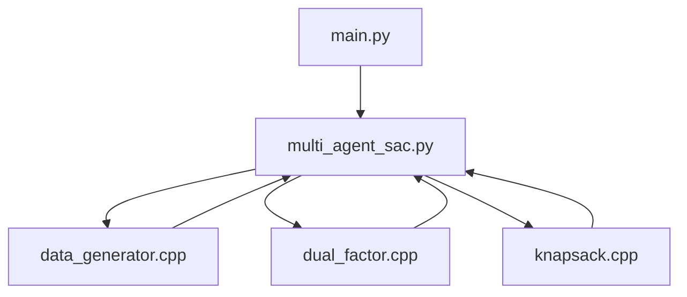

# MARLIP: A Hybrid Method Based on Multi-Agent Reinforcement Learning and Integer Programming for Dynamic Slab Design Problems in Steel Industry

This project implements the MARLIP method introduced in the paper "A Hybrid Method Based on Multi-Agent Reinforcement Learning and Integer 
Programming for Dynamic Slab Design Problems in Steel Industry", combining Multi-Agent Reinforcement Learning (MARL) with Integer Programming 
to develop schemes for the dynamic slab design problem in the steel industry.


## Description of Project Structure (based on CLion)

```
MARLIP_1/
├── cpp/                           
│   ├── CMakeLists.txt             
│   ├── data_generator.cpp         
│   ├── dual_factor.cpp            
│   ├── knapsack.cpp               
│   └── ReadData.cpp               
├── CMakeLists.txt
├── main.py                    
├── multi_agent_sac.py         
├── environment.yml            
```

Here is a polished and professional rewrite of your content:

---

The MARLIP method integrates integer programming with reinforcement learning to address the dynamic slab design problem. In this implementation, 
we use **PyTorch** for the reinforcement learning components and **C++** for the integer programming modules. The project consists of the following 9 key files:

- **cpp/CMakeLists.txt** — Builds the C++ components of the project.
- **cpp/data_generator.cpp** — Generates experimental instances and handles reading/writing of instance data.
- **cpp/dual_factor.cpp** — Constructs the optimization model used to obtain dual factors.
- **cpp/knapsack.cpp** — Implements the integer programming solution in MARLIP using the 2CDP method to optimally arrange order slabs.
- **cpp/ReadData.cpp** — (Deprecated/unused code; retained for legacy reasons).
- **CMakeLists.txt** — Configures and builds the entire project, integrating both Python and C++ components.
- **main.py** — The main entry point of the project.
- **multi_agent_sac.py** — Contains the implementation of the Multi-Agent Soft Actor-Critic (MASAC) algorithm used in MARLIP.
- **environment.yml** — Defines the required software environment and dependencies for running the MARLIP project.


The input-output relationships among the main code files in this project are illustrated below:




## Mapping Key Strategies in MARLIP to Code Components

The MARLIP framework incorporates several core strategies, including:

- The basic framework of the MASAC method (see Section V-B of the paper),
- The weights of the policies of MASAC (see Section V-C in the paper),
- The soft boundary of MASAC (see Section V-D in the paper),
- The dynamical programming used to obtain the exact solution (see Section V -E).


The **`ReplayBuffer`**, **`ValueNet`**, **`QNetwork`**, **`PolicyNetwork`**, and **`SACAgent`** classes in `multi_agent_sac.py` collectively form 
the backbone of the MASAC method. These classes handle the acquisition of the global state, joint observations, joint actions, and joint policies, 
alongside with global state transitions and reward computation in MASAC.


The calculation of the weights of the policies is implemented in the functions **`generate_possible_scheme`**, **`call_dual_factor`**, 
and **`calculate_policy_weight`** within the `MultiAgentEnv` class. The calculation of the weights relies on dual factors. The **`call_dual_factor`** function 
in `MultiAgentEnv` class invokes **`solveLinearProgramming`** function from `cpp/dual_factor.cpp`, which constructs and solves a linear programming model 
(as described in Model SP in Section V-C of the paper)to obtain the values of dual factors.


The **`update`** function in the `MultiAgentEnv` class implements the introduction of the soft boundary into the MASAC policy improvement process. 
The **`DeltaNet`** class dynamically adjusts the coefficient \( \delta \) to control the influence of the soft boundary.


Reward calculation in MARLIP depends on a complete slab decision scheme. The optimal arrangement of order plates in the slab decision scheme is solved 
by our dynamic programming method. This dynamic programming is implemented in **`cpp/knapsack.cpp`**. Then, the **`calculate_reward`** function 
in `MultiAgentEnv` class calls the **`TwoCDP`** function in `knapsack.cpp` to obtain the optimal arrangement of order plates. Based on the slab decision 
scheme, this **`calculate_reward`** function calculates the reward.


## Environment Configuration

The configuration of the MARLIP project includes both the Python environment and the C++ environment setup.

- **Python Environment Configuration**: The Python environment configuration is specified in the `environment.yml` file. To install the project dependencies, run the following command:
  ```
  conda env create -f environment.yml
  ```

- **C++ Environment Configuration**: The C++ environment setup refers to the installation and configuration of CPLEX software. CPLEX is used to solve the linear programming model for obtaining the dual factors, as described in Section V-C of the paper. The full name of the software is [**IBM ILOG CPLEX Optimization Studio**](https://www.ibm.com/cn-zh/products/ilog-cplex-optimization-studio). Ensure that the installed version of CPLEX is at least IBM ILOG CPLEX Optimization Studio 12.10 or higher.


## Run

To run the project, start by compiling the two `CMakeLists.txt` files to build the necessary components. 
Once the build is complete, execute the `main` function in `main.py` to launch the project.

Note: The `environment.yml` file may interfere with the build process. After setting up the environment, 
you can safely remove this file to prevent any potential conflicts.
